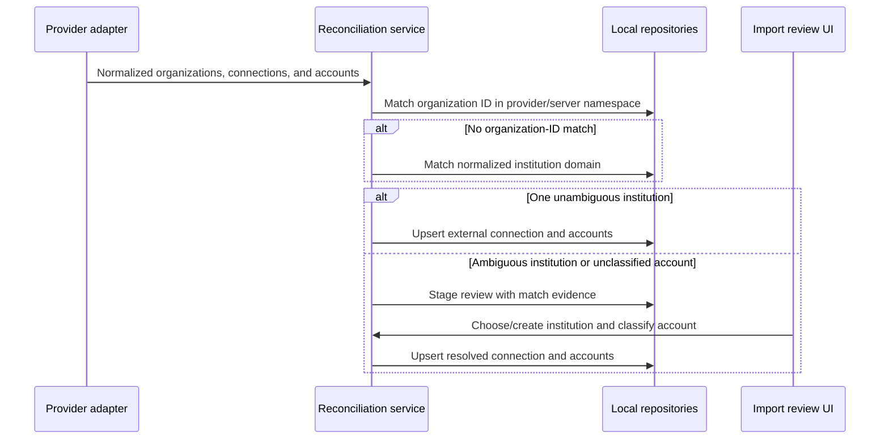

# 1. Separate Institutions from Provider Connections

Date: 2026-07-15

## Status

Accepted

## Context

The current `institution_connections` table represents institution identity, provider credentials, remote connection state, and account ownership in one record. `accounts.connection_id` therefore makes an account belong to an integration connection rather than to the real-world institution that holds it. This prevents a manual institution from existing without an integration and obscures which identity should survive when credentials are revoked.

The model also assumes too close a relationship between a credential and an institution. In the [SimpleFIN v2 protocol](https://www.simplefin.org/protocol.html), one Access URL returns an Account Set containing a list of connections and accounts. Each account references a `conn_id`; each connection identifies an organization; one server response may contain multiple connections; and separate logins to the same institution have different connection IDs with the same organization fields. SimpleFIN organization IDs are unique only within a SimpleFIN server, not globally.

We need stable local institution and account identities, manual data entry, exact import provenance, safe credential revocation, and automatic reconciliation without assuming that a provider identifier is globally unique. Existing local data is disposable at this pre-release stage, so we accept a destructive database reset instead of carrying the conflated model forward through a compatibility migration.

## Decision

### Use three distinct layers

We represent the integration boundary with three entities:

| Entity                          | Scope and identity              | Holds                                                                         | Read by                                         |
| ------------------------------- | ------------------------------- | ----------------------------------------------------------------------------- | ----------------------------------------------- |
| `Institution`                   | Stable local identity           | Display name and optional canonical website/domain                            | Accounts, UI, planning features                 |
| `ProviderConnection`            | One claimed provider credential | Provider/server namespace, status, `SecretStore` key reference                | Connector and connection-management code        |
| `ExternalInstitutionConnection` | One remote login/connection     | Provider connection, institution, remote connection and organization metadata | Reconciliation, sync health, account provenance |

Every `Account` has a required `institutionId`. An imported account also has an optional `externalConnectionId` and an external account ID scoped to that connection. Manual accounts omit the external connection.

One provider connection may have many external institution connections. Multiple external institution connections may resolve to one institution when the user has multiple logins at the same institution.

### Reconcile organizations before accounts

Provider adapters normalize their responses before reconciliation. The reconciliation service matches an organization by remote organization ID within the provider/server namespace, then by normalized domain. Ambiguous or conflicting candidates are sent to user review and are never merged silently.

After institution resolution, the service upserts the external connection using the provider connection and remote connection ID, then upserts accounts using the external connection and remote account ID. An account without a reliable provider subtype remains `unclassified` until the user reviews it.

### Preserve local records when a provider disconnects

Revoking or deleting a provider credential changes connection status but does not delete the institution, external-connection provenance, accounts, balances, holdings, obligations, or transactions. An institution cannot be deleted while it owns accounts.

### Why not keep institution identity on `institution_connections`

That design makes manual institutions artificial connection records and ties a durable business identity to revocable credentials. It also cannot represent multiple provider logins resolving to one local institution without duplicating the institution.

### Why not enforce one institution to one provider connection

SimpleFIN Access URLs may expose multiple institutions, and users may have multiple logins at the same institution. A one-to-one constraint contradicts the provider protocol and would either discard data or force duplicate local institutions.

### Why not attach accounts only to provider connections

A provider connection is a data source, not the holder of an account. Direct ownership would leave manual accounts without a natural parent and would make credential revocation appear to remove account identity. The optional external connection records provenance while the required institution records ownership.

### Why not require manual matching for every imported institution

Provider/server-scoped organization IDs and unique normalized domains are strong enough for deterministic matches. Automatic matching avoids repetitive review, while the ambiguity rule prevents uncertain identity merges.

## Consequences

### Positive

- Manual and imported accounts share one institution/account model.
- Institution identity survives provider changes and credential revocation.
- The model accurately represents one credential returning many institutions and multiple logins at one institution.
- Account and connection provenance remains explicit and idempotent.
- Future connectors can reuse provider-neutral reconciliation rather than encode their topology in the core domain.

### Negative

- The schema, repositories, contracts, and UI gain two connection layers instead of one combined record.
- Importing must reconcile institution identity before accounts and may pause for user review.
- Provider organization IDs require an explicit server namespace, and domain matching requires normalization.
- Existing local databases are incompatible with the rebuilt schema.

### Mitigations

- Keep connector-specific fields behind normalized provider contracts and expose plain-language labels in the UI.
- Store match evidence and test organization-ID, domain, conflict, and repeated-import cases with deterministic fixtures.
- Require explicit review for ambiguity and `unclassified` accounts instead of guessing.
- Document the destructive reset and require explicit user action; this is accepted because the application is pre-release and current data can be re-imported.
