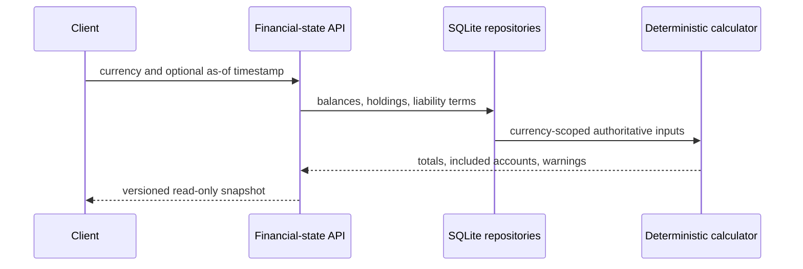

# 2. Currency-Scoped Authoritative Financial-State Snapshot

Date: 2026-07-17

## Status

Accepted

## Context

Planning features need one read-only view of money and obligations that actually exist. Summing all account balances makes investment assets appear available for daily spending; converting currencies without an exchange-rate source would invent financial values. The system structure requires current balances, institution-reported available balances, spendable funds, and forecast cash to remain distinct.

## Decision

### Produce a currency-scoped, versioned snapshot

`GET /financial-state` accepts one ISO currency and an optional as-of timestamp. It reads dated balances, holdings, and liability terms directly from their authoritative records and returns `financial-state-v1`. It does not read household facts, goals, assumptions, forecast income, allocation records, or scenario data.

| Value             | Includes                                                                            | Excludes                                         |
| ----------------- | ----------------------------------------------------------------------------------- | ------------------------------------------------ |
| Current balance   | Latest dated account balances                                                       | Forecast income and future allocations           |
| Available balance | Institution-reported available balances                                             | Accounts with no reported available amount       |
| Spendable funds   | Cash, checking, savings, and money-market balances; available balance when reported | CDs, investments, credit, loans, and liabilities |
| Net worth         | Account balances or holdings valuations, less liability terms                       | Currency conversion and unknown valuations       |

### Why explicit spendable account types, not all assets

Daily-spending capacity must not be inflated by investments that require a sale or by CDs that can have access delays or early-withdrawal penalties. The user confirmed that CDs are excluded. Investments remain visible in investment value and net worth.

### Why one currency, not implicit conversion

No authoritative exchange-rate source exists in the local system. Returning separate requests per currency preserves integer minor units and avoids fabricated converted totals.

## Consequences

### Positive

- Later forecast and allocation work reads one deterministic current-state boundary.
- Spendable cash, investments, liabilities, and net worth answer distinct user questions.
- Missing or stale source data remains visible rather than silently treated as zero.

### Negative

- Users with more than one currency must request each currency separately.
- The snapshot cannot represent explicit reserves until the allocation ledger exists.

### Mitigations

- Include currency, as-of metadata, calculation version, included account IDs, and warnings in every response.
- Keep forecast and reserve treatment out of this snapshot until their authoritative models are implemented.
