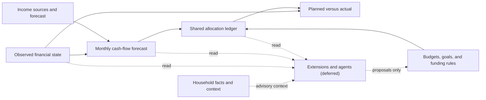

# System Structure

This document defines the financial concepts that form Almanac FI's core planning substrate. It is the canonical conceptual reference for contributors and AI agents changing financial-domain models, calculations, APIs, or user experiences.

Product goals remain in [product.md](../product.md). Architectural decisions and rejected alternatives belong in [doc/adr](./adr). This document explains what the core concepts mean and how they work together.

## Core invariants

1. Typed, validated financial records are the only authoritative inputs to financial calculations.
2. Generic household facts are contextual data. They never silently become balances, income, obligations, budgets, goals, or allocations.
3. Money that exists now is distinct from money forecast to arrive later.
4. Gross income, expected net income, and allocatable cash are distinct values.
5. Budgets and goals are different planning concepts, even when both receive funding.
6. Every future claim on cash flow is represented in one shared allocation ledger.
7. Active plans and hypothetical scenarios are isolated and versioned.
8. A dollar cannot be allocated more than once in the same plan period.
9. Missing financial inputs remain unknown and produce warnings; the system does not invent them.
10. Extensions and agents may read authoritative state and propose changes, but they do not bypass constraints or directly mutate an accepted plan.

## Structural overview



## Data authority

| Concept                  | Meaning                                      | Authoritative records                                                 | Never sourced only from                                    |
| ------------------------ | -------------------------------------------- | --------------------------------------------------------------------- | ---------------------------------------------------------- |
| Observed financial state | What exists or happened                      | Institutions, accounts, balances, transactions, holdings, liabilities | Forecasts or generic facts                                 |
| Forecast income          | What a person is expected to earn            | Person-linked income source and schedule                              | A transaction label alone                                  |
| Budget                   | Recurring spending envelope for a period     | Budget, period, and category target                                   | A goal or generic fact                                     |
| Goal                     | Accumulating target with a date              | Goal and funding progress                                             | A budget category alone                                    |
| Funding rule             | How forecast cash is directed                | Typed fixed or percentage allocation rule                             | Free-form instructions                                     |
| Allocation ledger        | Authoritative future claims on cash flow     | Versioned monthly allocation entries                                  | Feature-owned reservation stores                           |
| Household fact           | Context that may inform setup or explanation | Dated, sourced contextual fact                                        | Financial calculations without promotion to a typed record |

When contextual information begins to affect a financial calculation, it must be promoted to the appropriate typed entity. For example, a contextual note that a dependent may attend college can help create a proposal, but the accepted target amount, date, priority, and funding strategy belong to a typed goal.

## Observed financial state

Observed state is the factual ledger. It includes:

- account balances and institution-reported available balances as of a timestamp;
- transactions, splits, categories, and confirmed transfers;
- current investment holdings and valuation warnings;
- liability balances, terms, and required payments; and
- provenance, revisions, and audit history.

The system distinguishes:

- **current balance** — what an account contains;
- **available balance** — what the institution reports as available;
- **spendable funds** — eligible liquid funds after holds and explicit reserves; and
- **future allocatable cash** — forecast cash flow, which does not exist yet.

Snapshots declare their data-as-of timestamp, currencies, included accounts, liquidity rules, and missing-data warnings. Forecast records are never included in current available funds.

## Income sources and forecast

Forecast income belongs to a person in the household. Each income source records:

- income type, such as W-2, contractor, self-employment, bonus, or investment income;
- fixed or variable behavior;
- gross amount and cadence;
- expected net amount or explicit withholding assumptions;
- effective start and optional end dates;
- growth assumptions where applicable;
- confidence and variability bounds; and
- source and verification metadata.

Base pay, bonus, and other materially different income components are separate schedules. Monthly forecast rows are the common representation for next-month, six-month, annual, and five-year views; longer views aggregate the same monthly results.

Observed income transactions are matched to expected income occurrences. Reconciliation records expected gross/net amounts, observed deposits, variance, match confidence, and unresolved occurrences without rewriting the original forecast.

```text
gross forecast
  - withholding and deductions
  = expected net cash
  - required obligations and reserves
  = allocatable cash
```

## Budgets, goals, and funding rules

A **budget** is a recurring spending envelope. It resets for each period and is reconciled against categorized spending. Housing, groceries, restaurants, and leisure are typical budget buckets.

A **goal** accumulates funding toward a target amount and date. Emergency reserves, a house down payment, retirement funding, and a college fund are typical goals.

A funding rule directs forecast cash into a budget, goal, reserve, investment contribution, or unallocated buffer. Every rule declares:

- destination and destination type;
- fixed minor-unit amount or percentage amount;
- percentage basis: gross income, expected net income, or remaining allocatable cash;
- cadence and effective period;
- priority and constraint level;
- optional minimum and maximum;
- funding account or destination where applicable; and
- active plan and scenario version.

The term **funding allocation** is used for directing cash flow. **Investment asset allocation** remains reserved for portfolio composition such as stocks, bonds, and cash.

## Monthly forecast and allocation ledger

The deterministic forecast engine produces a versioned monthly timeline containing opening balances, forecast gross and net income, required obligations, budget funding, goal funding, planned investing, withdrawals, remaining surplus, and closing balances.

The allocation engine applies funding rules in declared priority and constraint order. It must:

- fund hard obligations before lower-priority allocations;
- evaluate fixed and percentage rules against their explicit bases;
- prevent over-allocation and duplicate claims;
- retain explicit unallocated surplus or shortfall;
- expose conflicts and affected destinations; and
- produce identical output for identical versioned inputs.

Rules are instructions. The allocation ledger is their materialized monthly result and the sole authoritative record of future claims on cash flow. No feature owns a separate forecast balance or reservation store.

## Active plans and scenarios

The active household plan is versioned and immutable after acceptance. A hypothetical scenario forks an explicit base version and stores its changes separately. Scenario calculations cannot alter active balances, rules, budgets, goals, or allocations.

Applying a user-reviewed scenario creates a new active plan and ledger version. Historical versions remain available for audit, comparison, and rollback by creating another version.

## Planned-versus-actual reconciliation

Reconciliation compares, but does not conflate:

- forecast income with classified income transactions;
- budget envelopes with categorized spending;
- goal allocations with actual contributions or designated balances;
- forecast balances with observed account balances; and
- planned debt payments with observed payments.

Every comparison declares its period, data-as-of timestamp, plan version, and unresolved or low-confidence matches.

## Context and future extensions

Household facts may provide relevant context such as preferences, family events, or tentative future plans. They may be included in an AI context only under the applicable privacy policy. They do not become authoritative financial inputs until a user accepts corresponding typed records.

Agentic planning, external model providers, feature-specific planners, MCP tools, and other integrations are deferred until the core structures in this document are implemented and verified. Future extensions must read the shared snapshot, forecast, and allocation ledger; simulate changes in an isolated scenario; explain conflicts; and submit proposals through an approved write boundary.

## Concept ownership

| Responsibility                                        | Primary workspace location                 |
| ----------------------------------------------------- | ------------------------------------------ |
| Deterministic calculations and constraint evaluation  | `packages/core`                            |
| Persistence, versioning, provenance, and repositories | `packages/db`                              |
| Validated request and response shapes                 | `packages/api-contracts`                   |
| HTTP capabilities                                     | `apps/server`                              |
| Human planning and reconciliation experience          | `apps/web`                                 |
| Deferred external and agent surfaces                  | `apps/cli`, `apps/mcp`, future AI adapters |
