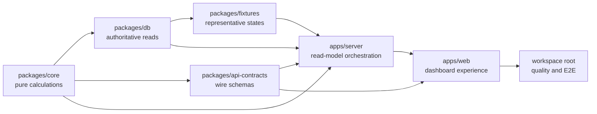

# Almanac FI UI Overhaul: Package Task Breakdown

Date: 2026-07-21

Status: Proposed implementation backlog

Source: [UI overhaul specification](../specs/2026-07-21-ui-overhaul.md)

Work item:
[038a — Dashboard UI overhaul and forecast visualization](../../../work-items/038a-dashboard-ui-overhaul-and-forecast-visualization/requirements.md)

## Purpose and ownership

This document converts the approved UI specification into implementation tasks
grouped by workspace package. Task IDs are stable references for issues, commits,
and pull requests. Tests are part of each task, not a later cleanup phase.

Ownership follows [`doc/system-structure.md`](../../../doc/system-structure.md):

| Responsibility                                       | Owner                    |
| ---------------------------------------------------- | ------------------------ |
| Pure, deterministic financial calculations           | `packages/core`          |
| Persistence, queries, provenance, and version lookup | `packages/db`            |
| Validated request and response shapes                | `packages/api-contracts` |
| HTTP orchestration and error mapping                 | `apps/server`            |
| Human-facing presentation and interaction            | `apps/web`               |
| Representative test data                             | `packages/fixtures`      |

The dashboard is a read model. React may format and render values, but it must not
become an authority for totals, occurrences, forecast reconciliation, or allocation
state. New endpoints must not create a second forecast or allocation store.

## Package dependency map



Contract examples, pure calculation interfaces, fixture design, and web design
tokens can start together. Each visible slice then proceeds from authoritative
inputs to calculation, contract, endpoint, and presentation.

## `packages/core`

### CORE-UI-01 — Date range and granularity semantics

Phase: 0

- Add typed ranges and day/week/month/quarter/year granularities.
- Resolve 7D, 30D, 90D, 1Y, 2Y, 5Y, and 10Y presets deterministically.
- Define boundaries and household-timezone behavior independently of browser locale.
- Test month ends, leap years, daylight-saving boundaries, and every preset switch.

Dependencies: none.

### CORE-UI-02 — Month-end unallocated funds

Phase: 1

- Calculate `unallocatedThroughPeriodEnd` from separately typed current funds,
  expected income, required commitments, plan allocations, and unresolved inputs.
- Return component totals, structured warnings, and a calculation version.
- Cover surplus, shortfall, missing income, missing obligations, and duplicate-ledger
  protection in tests.

Dependencies: CORE-UI-01.

### CORE-UI-03 — Commitment occurrence expansion

Phase: 2

- Expand income schedules, obligations, debt payments, budgets, goals, investments,
  and withdrawals into dated occurrences.
- Preserve source ID/type, confidence, funding status, observed match, and plan
  version; return indefensibly dated items under `undated`.
- Test weekly, biweekly, semi-monthly, monthly, quarterly, annual, start/end-date,
  leap-day, and daylight-saving cases.

Dependencies: CORE-UI-01.

### CORE-UI-04 — Observed cash-flow aggregation

Phase: 2

- Aggregate transaction actuals into inflow, outflow, and net buckets.
- Exclude confirmed transfers while reporting their count.
- Mark partial periods and incomplete categorization.
- Test splits, refunds, transfers, empty periods, and partial current periods.

Dependencies: CORE-UI-01.

### CORE-UI-05 — Allocation flow and Sankey model

Phase: 3

- Reconcile current-period actuals with the remaining active-plan ledger.
- Build typed nodes, links, accessible table rows, conservation totals, and warnings.
- Carry observed/forecast state and funding status on every link.
- Use property-style tests to prove flow conservation and no double allocation.

Dependencies: CORE-UI-02, CORE-UI-03, CORE-UI-04.

### CORE-UI-06 — Long-range forecast series

Phase: 4

- Aggregate authoritative monthly forecast/ledger rows for display without replacing
  their monthly source of truth.
- Return opening/closing balance, expected income, obligations, budgets, goals,
  investments, withdrawals, surplus, shortfall, and conflicts.
- Enforce active-plan/scenario isolation and aggregation equivalence in tests.

Dependencies: CORE-UI-01 and the existing allocation-ledger calculation.

### CORE-UI-07 — Review priority and net-worth history

Phase: 5

- Rank review items by severity, financial impact, date proximity, and stable
  tie-breakers.
- Aggregate observed assets, liabilities, and net worth with stale/missing counts.
- Reject implicit currency conversion.

Dependencies: CORE-UI-01.

Verification:

```bash
pnpm --filter @almanac-fi/core typecheck
pnpm vitest run packages/core/src/index.test.ts
```

Split the broad `index.ts` as work grows; suggested modules are
`dashboard-time.ts`, `commitment-occurrences.ts`, `cash-flow-series.ts`,
`allocation-flow.ts`, and `forecast-series.ts`.

## `packages/api-contracts`

### CONTRACT-UI-01 — Shared context and warnings

Phase: 0

- Add household, currency, timezone, global As Of, freshness, plan/scenario version,
  checksum, and calculation-version schemas.
- Add stable warning ID/code, severity, entity, message, and remediation route.
- Add completeness and observed/forecast state enums with valid/invalid examples.

Dependencies: CORE-UI-01 vocabulary.

### CONTRACT-UI-02 — Dashboard snapshot

Phase: 1

- Add request/response schemas for
  `GET /households/{id}/dashboard-snapshot`.
- Include spendable today, month-end unallocated, period summary, review summary,
  freshness, warnings, and versions.
- Validate complete, stale, partial, no-plan, and missing-input examples.

Dependencies: CONTRACT-UI-01, CORE-UI-02.

### CONTRACT-UI-03 — Commitments and cash flow

Phase: 2

- Add schemas for commitment occurrences and observed cash-flow series.
- Validate bounded ranges and granularities; model undated items separately.
- Require per-point provenance and completeness.

Dependencies: CONTRACT-UI-01, CORE-UI-03, CORE-UI-04.

### CONTRACT-UI-04 — Allocation flow

Phase: 3

- Add node, link, totals, reconciliation, warning, and table-row schemas.
- Require observed/forecast and funding status on links.
- Reject malformed links and references to missing nodes.

Dependencies: CONTRACT-UI-01, CORE-UI-05.

### CONTRACT-UI-05 — Forecast and net worth

Phase: 4-5

- Add forecast-series and net-worth-series schemas.
- Extend horizons with `two_year` and `ten_year`, retaining the existing views and
  supporting the approved one-month view.
- Require forecast versions/checksum; allow one optional scenario ID.

Dependencies: CONTRACT-UI-01, CORE-UI-06, CORE-UI-07.

Verification:

```bash
pnpm --filter @almanac-fi/api-contracts typecheck
pnpm vitest run packages/api-contracts/src/index.test.ts
```

Use focused source files re-exported from the package entry point.

## `packages/db`

### DB-UI-01 — Dashboard context query support

Phase: 0-1

- Add household timezone with an explicit default for existing local data.
- Read latest eligible balance, transaction, sync, calculation, active-plan,
  forecast-run, and ledger-run timestamps and IDs.
- Prove as-of reads never select future records.

Dependencies: CONTRACT-UI-01.

### DB-UI-02 — Snapshot read repository

Phase: 1

- Compose existing financial-state and planning-dashboard reads into CORE-UI-02
  inputs without changing ADR 0002's financial-state boundary.
- Fetch review counts and entity references without loading full record lists.
- Cover stale, missing-plan, missing-forecast, surplus, and shortfall states.

Dependencies: DB-UI-01, CORE-UI-02.

### DB-UI-03 — Commitment source repository

Phase: 2

- Read effective-dated income, obligations, liabilities, budgets, goals,
  investments, withdrawals, and observed matches for a bounded range.
- Supply recurrence inputs to CORE-UI-03; do not persist derived occurrences unless
  profiling later proves that necessary.
- Enforce plan/scenario isolation and preserve undated/low-confidence records.

Dependencies: DB-UI-01, CORE-UI-03.

### DB-UI-04 — Observed history repositories

Phase: 2 and 5

- Add bounded transaction reads with transfer/split/category context for cash flow.
- Add dated balance, valuation, and liability reads for net-worth history.
- Return source completeness metadata and deterministic ordering.

Dependencies: DB-UI-01, CORE-UI-04, CORE-UI-07.

### DB-UI-05 — Allocation-flow source repository

Phase: 3

- Read the selected immutable ledger run, actuals, and reconciliation records.
- Ensure plan version, ledger run, and period are internally consistent.
- Return structured not-ready/warning states for missing or superseded runs.

Dependencies: DB-UI-03, the cash-flow portion of DB-UI-04, CORE-UI-05.

### DB-UI-06 — Forecast-series source repository

Phase: 4

- Read up to ten years of monthly ledger/forecast rows with bounded queries.
- Resolve the active plan by default or one explicit scenario.
- Return base versions, run IDs, checksums, conflicts, and missing inputs.

Dependencies: DB-UI-01, CORE-UI-06.

### DB-UI-07 — Measured query optimization

Phase: 5

- Capture representative plans/timings for snapshot, 90-day commitments, one-year
  history, and ten-year forecast reads.
- Add only indexes or rewrites justified by measured fixture performance.

Dependencies: DB-UI-02 through DB-UI-06, FIXTURE-UI-01.

Verification:

```bash
pnpm --filter @almanac-fi/db typecheck
pnpm vitest run packages/db/src/index.test.ts packages/db/src/planning.test.ts
```

Add focused dashboard repository test files instead of expanding only the broad
existing tests.

## `packages/fixtures`

### FIXTURE-UI-01 — Representative dashboard household

Phase: 0

Seed authoritative domain rows for:

- Multiple spendable/non-spendable accounts and dated balances.
- Observed current-month income/spending plus remaining forecast income.
- Confirmed transfers, recurring bills, budgets, goals, investments, and buffer.
- An active plan, immutable ledger run, and one isolated scenario.
- A future shortfall, conflict, stale balance, missing valuation, low-confidence
  match, and undated commitment.
- Prior/current/next months, one-year history, and ten-year monthly forecast.

Done when seeding is deterministic, targets real domain tables rather than only
generic source records, and supports all six 60-second success questions.

Dependencies: DB-UI-01 schema decisions.

### FIXTURE-UI-02 — Focused edge states

Phase: 1-4

Add named fixtures for no data, no active plan, missing required inputs,
multi-currency rejection, fully observed prior month, forecast-only future month,
shortfall, and scenario divergence.

Dependencies: FIXTURE-UI-01 and corresponding contracts.

Verification:

```bash
pnpm --filter @almanac-fi/fixtures typecheck
pnpm vitest run packages/fixtures/src/index.test.ts
```

## `apps/server`

### SERVER-UI-01 — Dashboard route module and request context

Phase: 0-1

- Create a focused dashboard route module instead of growing `src/index.ts`.
- Parse household, As Of, currency, timezone, period, range, granularity, and
  optional scenario consistently.
- Map validation, not-found, currency mismatch, not-ready, and internal errors to
  the existing envelope.
- Prove dashboard routes cannot call an AI provider.

Dependencies: CONTRACT-UI-01, DB-UI-01.

### SERVER-UI-02 — Snapshot endpoint

Phase: 1

Deliver `GET /households/:id/dashboard-snapshot` by composing DB-UI-02 and
CORE-UI-02 and validating with CONTRACT-UI-02. Cover complete, stale, partial,
no-plan, and missing-input HTTP cases.

Dependencies: SERVER-UI-01, DB-UI-02, CONTRACT-UI-02.

### SERVER-UI-03 — Commitments and cash-flow endpoints

Phase: 2

Deliver:

- `GET /households/:id/commitment-occurrences`
- `GET /households/:id/cash-flow-series`
- Bounded range validation supporting the approved presets

Trace fixture totals to source IDs and use the standard error envelope.

Dependencies: SERVER-UI-01, DB-UI-03, DB-UI-04, CONTRACT-UI-03.

### SERVER-UI-04 — Allocation-flow endpoint

Phase: 3

Deliver `GET /households/:id/allocation-flow`, asserting conservation totals,
unique links, and real source references in HTTP tests.

Dependencies: SERVER-UI-01, DB-UI-05, CONTRACT-UI-04.

### SERVER-UI-05 — Forecast and net-worth endpoints

Phase: 4-5

Deliver:

- `GET /households/:id/forecast-series`
- `GET /households/:id/net-worth-series`
- Active-plan default and optional one-scenario selection

Require forecast provenance, prevent scenario mutation, and reject implicit
currency conversion.

Dependencies: SERVER-UI-01, DB-UI-04, DB-UI-06, CONTRACT-UI-05.

Verification:

```bash
pnpm --filter @almanac-fi/server typecheck
pnpm vitest run apps/server/src/index.test.ts
```

Add endpoint-specific test files as routes are extracted.

## `apps/web`

### WEB-UI-01 — Design tokens and UI primitives

Phase: 0

- Implement the calm analytical direction with CSS tokens for color, typography,
  spacing, radius, border, elevation, and motion.
- Add reusable page, card, metric, warning, range-control, legend, skeleton,
  empty/error, and provenance primitives.
- Use tabular numerals, consistent money formatting, visible focus, semantic
  landmarks, and reduced-motion behavior.

Dependencies: none.

### WEB-UI-02 — Visualization foundation spike

Phase: 0

- Compare native SVG/React with narrowly scoped chart dependencies for time series
  and Sankey rendering.
- Measure bundle cost, accessibility, responsiveness, tooltip control, and support
  for observed/forecast styling.
- Record an ADR if a durable cross-cutting library/abstraction is adopted.
- Build shared frame, axis, legend, tooltip, state, and accessible-table primitives.

Dependencies: WEB-UI-01.

### WEB-UI-03 — Shell, route map, and Settings consolidation

Phase: 1

- Use Dashboard, Activity, Planning, Review, and Settings as primary navigation.
- Move institutions, accounts, connections, imports, categories, rules, household,
  providers, privacy, telemetry, and developer tools into Settings groups.
- Keep scenarios in Planning and AI Workbench under Developer tools.
- Add explicit legacy redirects, desktop sidebar, and limited narrow-width
  snapshot/review navigation.

Dependencies: WEB-UI-01.

### WEB-UI-04 — Typed API client and URL time state

Phase: 1

- Add a validated API function and React Query hook per endpoint.
- Put global As Of, local range, scenario, and useful drill-down state in URL search
  state.
- Allow independent module loading/retry and prove no dashboard request targets an
  AI/model endpoint.

Dependencies: CONTRACT-UI-01, WEB-UI-03, and endpoint-specific contracts.

### WEB-UI-05 — Factual dashboard snapshot

Phase: 1

- Build header/context, Spendable today, Unallocated through month-end, commitment
  preview, Needs attention, freshness, plan version, and Review badge.
- Cover loading, empty, stale, partial, no-plan, and error states.
- Keep all dashboard drill-down read-only; editing starts in the destination flow.

Dependencies: WEB-UI-03, WEB-UI-04, SERVER-UI-02.

### WEB-UI-06 — Commitments and detail drawer

Phase: 2

- Build 7D, 30D, 90D, 1Y, and 2Y forward timeline/list views.
- Show inflow/outflow, observed/forecast, confidence, funding, and undated states.
- Add a reusable read-only detail drawer with source context and edit-route handoff.
- Trap/restore focus and support full keyboard operation.

Dependencies: WEB-UI-04, SERVER-UI-03.

### WEB-UI-07 — Cash-flow history

Phase: 2

- Build an observed-only cash-flow chart and synchronized table for month, quarter,
  and year ranges.
- Show inflow/outflow/net, transfer-exclusion notes, and partial-period treatment.

Dependencies: WEB-UI-02, WEB-UI-04, SERVER-UI-03.

### WEB-UI-08 — Allocation Sankey

Phase: 3

- Build previous/current/next-month views.
- Distinguish current-month actual-to-date from forecast remainder using more than
  color.
- Add node/link hover, focus, click, accessible table, drawer drill-down, shortfall,
  unfunded, partial, and failed-chart states.

Dependencies: WEB-UI-02, WEB-UI-04, WEB-UI-06, SERVER-UI-04.

### WEB-UI-09 — Active-plan forecast and scenario overlay

Phase: 4

- Build 1M, 1Y, 2Y, 5Y, and 10Y forecast views with automatic aggregation.
- Show one active plan by default and one clearly hypothetical optional overlay.
- Link first-shortfall/conflict markers to details and Planning.
- Add a goals/funding summary from the same versioned data.

Dependencies: WEB-UI-02, WEB-UI-04, WEB-UI-06, SERVER-UI-05.

### WEB-UI-10 — Net worth and Review completion

Phase: 5

- Build net-worth history with stale/missing valuation treatment.
- Complete curated Review for conflicts, undated commitments, stale data,
  low-confidence matches, and missing inputs.
- Link planned-versus-actual comparisons from relevant modules.

Dependencies: WEB-UI-04, WEB-UI-06, SERVER-UI-05, CORE-UI-07.

### WEB-UI-11 — Responsive, accessibility, and performance hardening

Phase: 5

- Verify 1280/1440/1920 desktop, 900 intermediate, and 390/430 snapshot widths.
- Complete keyboard, screen-reader, high-contrast, and reduced-motion passes.
- Profile bundle size, chart rendering, rerenders, and request waterfalls; lazy-load
  secondary charts without delaying the primary snapshot.

Dependencies: WEB-UI-05 through WEB-UI-10.

Verification:

```bash
pnpm --filter @almanac-fi/web typecheck
pnpm vitest run apps/web/src/app.test.tsx
pnpm --filter @almanac-fi/web build
```

As work starts, split the current broad `app.tsx`, `api.ts`, and `styles.css` into
focused `routes/`, `components/`, `dashboard/`, and `styles/` modules.

## Workspace root and cross-package quality

### ROOT-UI-01 — Contract fixture harness

Phase: 0

- Seed named fixtures, freeze time/timezone, start an injectable server, and expose
  validated examples to server and web tests.
- Reuse the same authoritative totals across core, HTTP, and UI tests.

Dependencies: CONTRACT-UI-01, FIXTURE-UI-01, SERVER-UI-01.

### ROOT-UI-02 — Incremental end-to-end journeys

Phase: 1-5

Automate the six 60-second questions, Sankey drill-down, 7D-to-2Y commitment range,
scenario comparison, conflict-to-Planning handoff without mutation, legacy route
redirects, and keyboard-only snapshot/review. Retain screenshots and traces on
failure.

Dependencies: corresponding server and web tasks.

### ROOT-UI-03 — Accessibility and visual gates

Phase: 5

- Add automated accessibility checks and deterministic screenshots at approved
  widths.
- Document manual screen-reader, high-contrast, and chart-table checks.

Dependencies: WEB-UI-11, ROOT-UI-02.

### ROOT-UI-04 — Release gate

Phase: every merge

```bash
pnpm check
```

Formatting, lint, typecheck, unit/integration tests, and production builds must pass
without unrelated regressions.

## Packages intentionally unchanged at first

| Package                | Initial treatment                                                          |
| ---------------------- | -------------------------------------------------------------------------- |
| `apps/cli`             | No dashboard surface; preserve current behavior.                           |
| `apps/mcp`             | No new reads until HTTP contracts stabilize.                               |
| `packages/feature-sdk` | Defer dashboard extension slots to Phase 5 documentation.                  |
| `packages/config`      | Change only for a measured server/UI configuration need.                   |
| `packages/secrets`     | No change; dashboard never reads or exposes secrets.                       |
| `packages/telemetry`   | Add only privacy-safe performance/error events after the factual UI works. |

All still pass the root release gate. Later CLI, MCP, and extension work must consume
the stabilized contracts rather than introduce alternative calculations.

## Recommended execution waves

### Wave 0 — Foundations

CORE-UI-01, CONTRACT-UI-01, FIXTURE-UI-01 design, WEB-UI-01, WEB-UI-02, and the
SERVER-UI-01 skeleton can proceed together.

Exit: vocabulary, date semantics, chart approach, route boundary, and representative
data are stable.

### Wave 1 — First useful dashboard

CORE-UI-02 → DB-UI-01/02 → CONTRACT-UI-02 → SERVER-UI-02 → WEB-UI-03/04/05 → the
first ROOT-UI-02 journey.

Exit: the first viewport answers spendable now and unallocated month-end, and all
existing workflows remain reachable.

### Wave 2 — Near-term movement

CORE-UI-03/04 → DB-UI-03/04 → CONTRACT-UI-03 → SERVER-UI-03 → WEB-UI-06/07.

Exit: upcoming commitments and observed cash-flow history are traceable.

### Wave 3 — Allocation understanding

CORE-UI-05 → DB-UI-05 → CONTRACT-UI-04 → SERVER-UI-04 → WEB-UI-08.

Exit: previous, current, and next-month flow reconciles as chart and table.

### Wave 4 — Long-range planning

CORE-UI-06 → DB-UI-06 → CONTRACT-UI-05 forecast → SERVER-UI-05 forecast →
WEB-UI-09.

Exit: the active plan and one optional scenario work from one month to ten years.

### Wave 5 — Consolidation

CORE-UI-07 and DB-UI-04 net worth → remaining CONTRACT/SERVER-UI-05 → WEB-UI-10/11
→ DB-UI-07 and ROOT-UI-03.

Exit: history, Review, accessibility, responsiveness, and performance meet the spec.

## Suggested pull-request slices

Package ownership is horizontal, but lower-risk changes land as vertical slices:

1. Date semantics, shared context, fixture skeleton, and design tokens.
2. Dashboard route module, new shell, Settings, and legacy redirects.
3. Spendable and month-end unallocated from core through web.
4. Commitment occurrences from core through timeline.
5. Observed cash flow from core through chart/table.
6. Allocation reconciliation through Sankey/table.
7. Monthly ledger through active-plan forecast.
8. Scenario overlay and conflict drill-down.
9. Net-worth history and completed Review inbox.
10. Accessibility, performance, responsive, and deprecation hardening.

Each slice leaves `pnpm check` passing and has a user-visible or contract-level
acceptance test.

## Global definition of done

- The six primary financial questions are answerable in under 60 seconds using the
  representative fixture.
- Totals reconcile to authoritative records and declared calculation versions.
- Current and forecast money are never visually or semantically conflated.
- Active plan is the default; scenarios are clearly hypothetical.
- Stale, missing, partial, and low-confidence data remains visible.
- Existing workflows remain reachable under the new information architecture.
- Dashboard loading makes no model-provider request.
- Keyboard, screen-reader, contrast, responsive, and performance checks pass.
- `pnpm check` passes from the workspace root.
